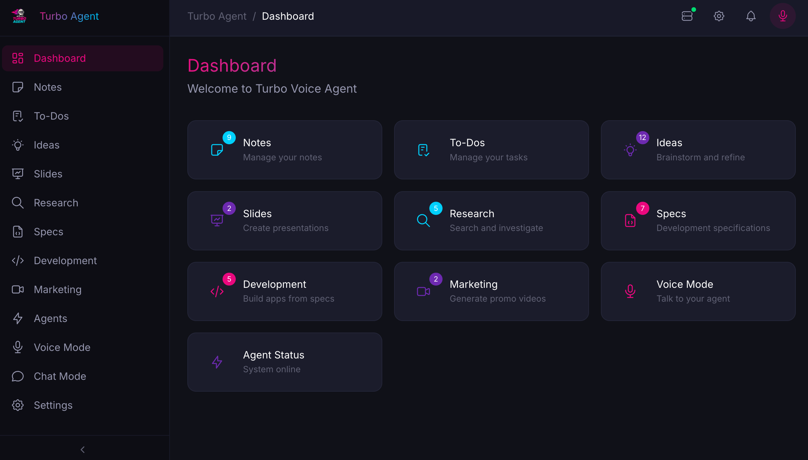
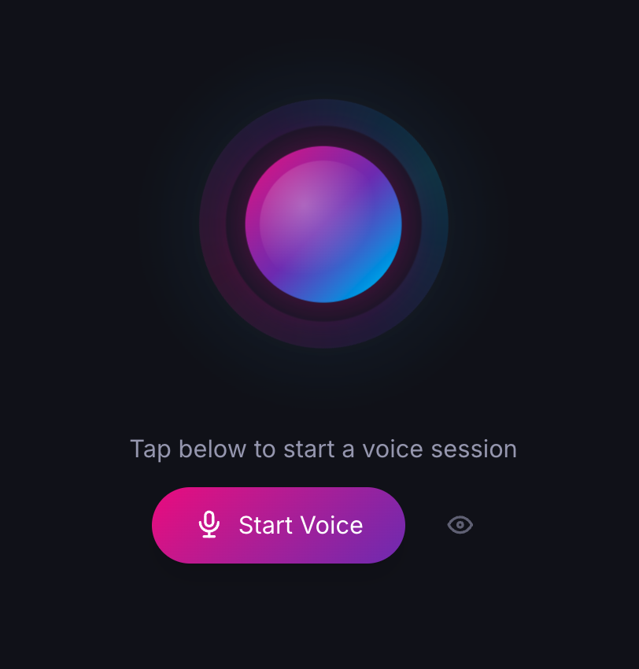
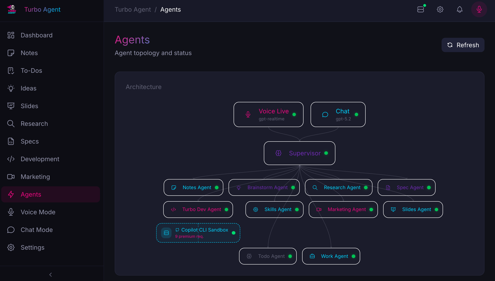
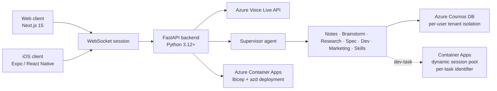

# Turbo Voice Agent

> Real-time conversational AI voice agent with multi-agent orchestration on Azure.

Turbo Voice Agent is a full-stack reference implementation for building voice-first AI experiences on Azure. It combines a FastAPI backend, a Next.js web client, and an Expo-based iOS app with specialist-agent routing, tenant-aware data access, and Azure-native deployment via `azd`.

It is designed for teams who want a production-style starting point for real-time speech, multi-agent orchestration, and modern Azure deployment patterns without starting from scratch.

## Screenshots



The dashboard surfaces every specialist capability — notes, ideas, research, specs, dev, marketing, video, journal, and skills — behind a single voice-first experience.



Voice Mode is a real-time, full-duplex conversation with the supervisor agent powered by the Azure Voice Live API.

## Key Features

- Real-time voice conversations over WebSockets using Azure Voice Live API
- Supervisor-driven routing across specialist agents for notes, brainstorming, research, specs, development, marketing, and skills
- Tenant-isolated data access backed by Azure Cosmos DB
- Web frontend built with Next.js 15, React 19, Tailwind CSS v4, and MSAL authentication
- Mobile iOS client built with React Native and Expo
- Azure-native deployment with Bicep, Azure Container Apps, and `azd`
- Local-first development workflow with Docker-based Cosmos DB emulation
- Dark-mode-first product styling and reusable frontend component patterns

## Architecture



A `SupervisorAgent` routes voice and chat requests to nine specialist agents, each owning a focused capability and its own tools.



- **Backend:** FastAPI service layer with dual Cosmos DB and in-memory implementations
- **Web:** Next.js 15 App Router frontend with React 19, Tailwind CSS v4, shadcn/ui patterns, and Tabler Icons
- **Mobile:** Expo / React Native iOS client
- **Auth:** Azure Entra ID on web + backend JWT validation (`AUTH_DISABLED=true` for local development)
- **Sandbox:** Per-task code execution via an Azure Container Apps **dynamic session pool** (`sp-sandbox-*`). The backend's managed identity calls the pool's management endpoint with `?identifier={taskId}` — one Hyper-V-isolated session per dev-task. Local dev falls back to a docker-compose `sandbox` container when `SESSION_POOL_MANAGEMENT_ENDPOINT` is unset.
- **Infra:** Azure Container Apps, Azure AI services, Azure Files, Cosmos DB, and the session pool provisioned through Bicep

### How sandbox execution works

1. The user starts a dev-task. The backend generates a `taskId` (UUID) and uses it as the session **identifier**.
2. `SessionSandboxClient` calls `POST {management-endpoint}/tasks?identifier={taskId}&api-version=2025-02-02-preview` with a bearer token from `DefaultAzureCredential` (scope `https://dynamicsessions.io/.default`). The pool allocates a prewarmed sandbox container on first request (cold start <2s).
3. On the first call only, the backend attaches `X-GH-Token: <user PAT>` so the container can `gh auth login --with-token` and clear the secret from memory.
4. Subsequent `/tasks`, `/files`, SSE-stream calls reuse the same identifier and hit the same sandbox until the pool's `cooldownPeriodInSeconds` elapses.
5. On user cancel / task completion / disconnect, the backend calls `POST /.management/stopSession?identifier={taskId}` to release the session early.

## Prerequisites

Before you deploy or contribute, make sure you have:

- An Azure subscription with permission to create resources
- [Azure CLI (`az`)](https://learn.microsoft.com/cli/azure/install-azure-cli)
- [Azure Developer CLI (`azd`)](https://learn.microsoft.com/azure/developer/azure-developer-cli/install-azd)
- Docker Desktop (for the local Cosmos DB emulator)
- Node.js 20+ and npm
- Python 3.12+
- A GitHub account (for automated deployments)
- An Azure Entra ID tenant (this can be the same directory tied to your Azure subscription)

## Manual Deployment (azd)

1. **Clone and authenticate**

   ```bash
   git clone <fork-url>
   cd turbo-voice-agent
   az login
   azd auth login
   ```

2. **Deploy**

   ```bash
   azd up
   ```

   On first run, the preprovision hooks will:
   - Detect your Azure subscription, tenant, and signed-in identity
   - Prompt once for custom domain settings (optional — press Enter to skip)
   - Query Azure for AI Foundry model availability + quota across regions and let you pick a region per model group (Primary, Voice, Research)
   - Create the Entra ID app registration for the web app

   All parameters are saved to the azd environment. Subsequent `azd up` runs reuse them without prompting.

   To override anything later (region, custom domain, etc.) use `azd env set <NAME> <VALUE>` and re-run `azd up`.

3. **Verify**

   `azd up` prints the deployed frontend and backend URLs. Open the frontend URL, sign in, and verify the voice interface loads.

## Automated Deployment (GitHub Actions)

1. **Fork the repository** into your own GitHub account or organization.
2. **Create an Entra app registration** for GitHub Actions OIDC. Use a dedicated app registration for CI so you can scope permissions cleanly.
3. **Add federated credentials** for the branches or environments you want to deploy from (for example, `main` and your production environment).
4. **Configure repository variables and optional secrets** in your fork.
5. **Enable the deployment workflow in your fork if needed**, then push to `main` or run the workflow manually.

### Federated credential guidance

For Azure OIDC with GitHub Actions, configure federated credentials that trust your fork's repository and the branches or environments you plan to deploy from. Typical subjects are:

- `repo:<owner>/<repo>:ref:refs/heads/main`
- `repo:<owner>/<repo>:environment:production`

Use the GitHub Actions + Azure workload identity flow documented by Microsoft for the exact portal or CLI steps.

### Required GitHub repository variables

| Variable | Required | Description |
| --- | --- | --- |
| `AZURE_CLIENT_ID` | Yes | Client ID of the Entra app registration used by GitHub Actions |
| `AZURE_TENANT_ID` | Yes | Azure tenant ID for the GitHub Actions identity |
| `AZURE_SUBSCRIPTION_ID` | Yes | Azure subscription that hosts the deployment |
| `AZURE_ENV_NAME` | Yes | `azd` environment name used by the workflow |
| `AZURE_LOCATION` | Yes | Default Azure region for the `azd` environment |
| `AZURE_RESOURCE_GROUP` | Yes | Resource group name the workflow refreshes and deploys into |
| `ENTRA_TENANT_ID` | Yes | Tenant ID consumed by the app at deploy time |
| `ENTRA_CLIENT_ID` | Yes | Frontend/backend app registration client ID |
| `AZURE_OPENAI_LOCATION_PRIMARY` | Yes | Region for Primary AI Foundry (gpt-5.2, gpt-4.1, gpt-4o-transcribe) |
| `AZURE_OPENAI_LOCATION_VOICE` | Yes | Region for Voice AI Foundry (gpt-realtime) |
| `AZURE_OPENAI_LOCATION_RESEARCH` | Yes | Region for Research AI Foundry (o3-deep-research) |
| `CUSTOM_DOMAIN_NAME` | No | Custom frontend hostname; can be empty |
| `EXISTING_CERT_NAME` | No | Existing managed certificate name; can be empty |

### Optional GitHub repository secrets

| Secret | Required | Description |
| --- | --- | --- |
| `ENTRA_CLIENT_SECRET` | No | Only required if you enable Microsoft To Do OAuth flows |

Once configured, pushing to `main` should run the Azure deployment workflow in your fork.

## Local Development

### Backend

```bash
cd backend
cp .env.example .env
# Edit .env and set AUTH_DISABLED=true for local development if you do not want to sign in with Entra ID.

python -m venv .venv
source .venv/bin/activate
pip install -e ".[dev]"
uvicorn app.main:app --reload --port 8000
```

Start the local Cosmos DB emulator before running the backend:

```bash
docker compose up -d
```

### Frontend

```bash
cd frontend
cp .env.local.example .env.local
npm install
npm run dev
```

The frontend expects `NEXT_PUBLIC_API_URL=http://localhost:8000` for local development.

### Mobile

```bash
cd mobile
npm install
npx expo start --ios
```

The mobile app currently targets iOS development.

#### Optional: HTTPS for on-device microphone access

iOS devices require HTTPS for microphone access when the Expo client talks to a backend over the LAN. A helper script generates a self-signed certificate pinned to your machine's LAN IP:

```bash
./scripts/gen-dev-cert.sh
```

The script writes `key.pem`, `cert.pem`, and `cert.der` to `backend/.local-certs/` (gitignored). Run the backend with TLS using the printed `uvicorn` command, then install `cert.der` as a trusted profile on your iOS device. These files are for local development only — never commit them.

## Testing

### Backend

```bash
cd backend
pip install -e ".[dev]"
pytest
ruff check .
ruff format .
```

### Frontend

```bash
cd frontend
npm install
npm run lint
npx playwright test
```

## Contributing

Contributions are welcome.

1. Review the [Code of Conduct](CODE_OF_CONDUCT.md).
2. Fork the repository and create a feature branch.
3. Use Conventional Commits where possible (`feat:`, `fix:`, `chore:`, `docs:`).
4. Open a pull request with a clear summary, implementation notes, and validation steps.
5. For non-trivial changes, follow the OpenSpec workflow in [`openspec/`](openspec/).

The `.squad/` directory contains project-specific maintainer metadata and is not required for running or deploying the application.

## License

This project is licensed under the MIT License. See [LICENSE](LICENSE) for details.

## Acknowledgments

- Azure Voice Live API
- Azure AI Foundry / Azure OpenAI
- Azure Container Apps
- Azure Cosmos DB
- Microsoft Agent Framework
